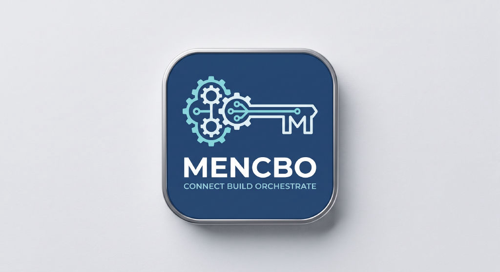

# MenCbo Monorepo

<p align="center"></p>

[](https://github.com/hdot123-org/mencbo/actions/workflows/ci.yml)

pnpm workspace 单仓多包：面向 AI 应用的 TS 记忆引擎库 **`mencbo`**（npm 包）与 macOS 桌面控制台 **MenCbo.app** 共用一个仓库、各自独立发布。

## 结构

```
packages/
  mencbo/          TS 记忆引擎库（npm: mencbo）— 零依赖、同构、分层记忆
apps/
  desktop/         MenCbo 桌面应用
    daemon/        Phase 1-2 · Python 单进程统一调度守护器（uv 管理）
    client/        Phase 3 · Tauri v2 + TypeScript 控制台客户端
```

## 快速开始

库（Node >= 18 或任意现代浏览器）：

```bash
pnpm install
pnpm -F mencbo run test        # vitest
pnpm -F mencbo run typecheck   # tsc --noEmit
pnpm -F mencbo run build       # tsc -> packages/mencbo/dist/
```

守护器（Python >= 3.12）：

```bash
cd apps/desktop/daemon
uv sync
uv run pytest
```

## 桌面端路线图

- [x] **Phase 1** 基础契约：`TaskSpec`（契约 2）、Git 作用域解析（契约 1）、示例任务清单
- [x] **Phase 2** 单进程 asyncio 统一调度器、`~/.mencbo/state.json`（契约 3）、CLI status
- [x] **Phase 3** Tauri v2 托盘客户端、控制面板与 daemon 实时联动（#18）
- [ ] **Phase 4** Python 冻结为 sidecar 二进制，打包输出 `MenCbo.dmg`

## 文档

- 库文档（中/英）：[packages/mencbo/README.md](packages/mencbo/README.md) · [README.en.md](packages/mencbo/README.en.md)
- 桌面应用：[apps/desktop/README.md](apps/desktop/README.md)
- 贡献指南：[CONTRIBUTING.md](CONTRIBUTING.md)

## 许可证

[MIT](LICENSE) © hdot123-org and contributors
